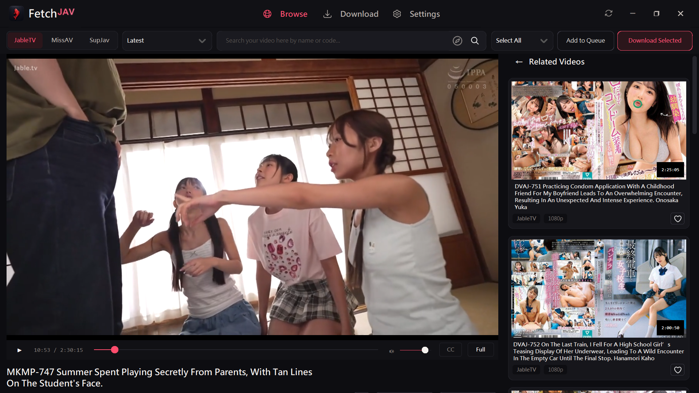
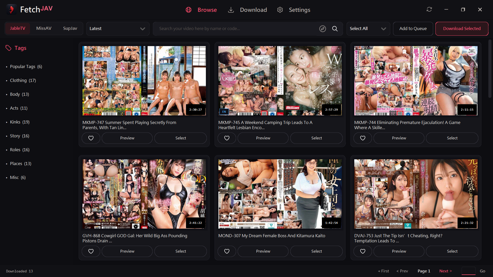
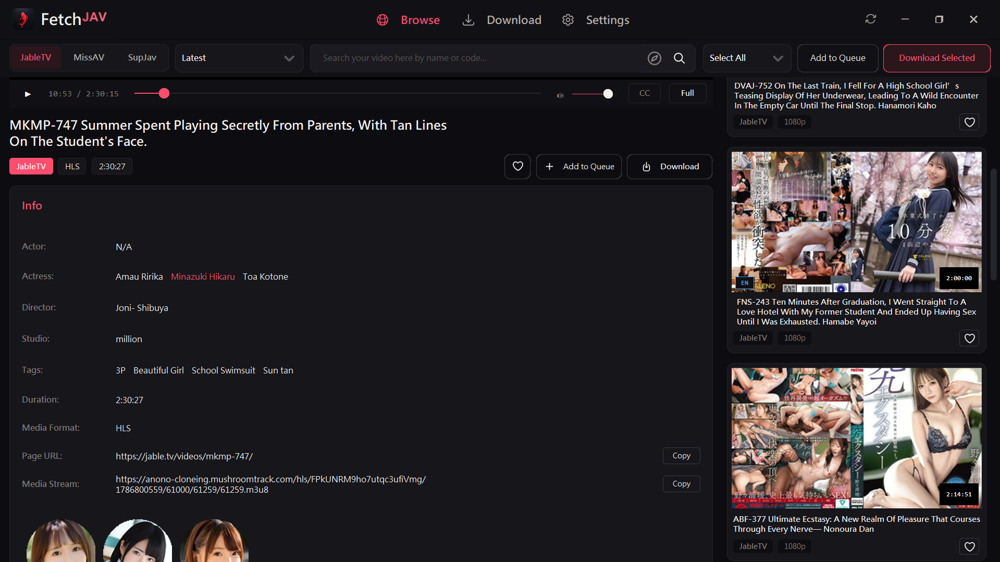
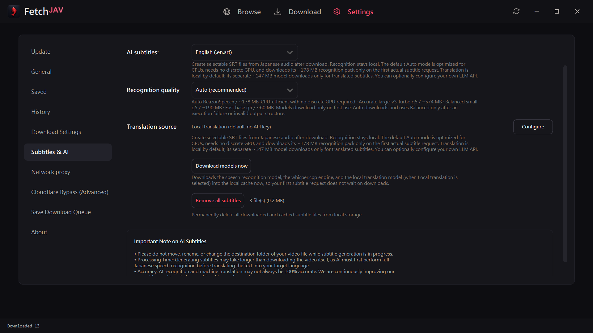
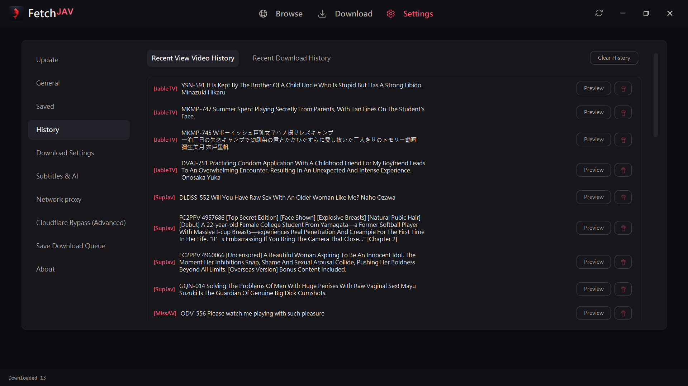

<p align="center">
  <strong>English</strong> · <a href="./README.md#-繁體中文-traditional-chinese">繁體中文</a>
</p>

<h1 align="center">FetchJAV</h1>

<p align="center">
  <strong>The Ultimate Desktop Downloader, Video Streamer & AI Subtitle Generator</strong><br />
  Stream, download, and automatically transcribe videos from <strong>JableTV</strong>, <strong>MissAV</strong>, and <strong>SupJav</strong> with local & cloud AI subtitle engines.
</p>

<p align="center">
  <a href="https://github.com/DeepanshuK2002/FetchJAV/releases/latest"></a>
  <a href="https://github.com/DeepanshuK2002/FetchJAV/releases"></a>
  <a href="https://github.com/DeepanshuK2002/FetchJAV"></a>
  <a href="./LICENSE"></a>
  <a href="https://github.com/DeepanshuK2002/FetchJAV/pkgs/container/jabletv"></a>
</p>

<p align="center">
  <strong><a href="https://github.com/DeepanshuK2002/FetchJAV/releases/latest/download/FetchJAV.exe">⬇️ Download FetchJAV.exe (Windows Direct)</a></strong>
  ·
  <a href="https://github.com/DeepanshuK2002/FetchJAV/releases/latest">📦 View Latest Release</a>
</p>

---

## 🌟 Key Features & Visual Walkthrough

### 1. Multi-Site Browse & Discovery Gallery
Browse, search, and filter videos across **JableTV**, **MissAV**, and **SupJav** in a single unified interface. Features responsive high-resolution cover cards, actress links, studio details, and multi-selection for bulk downloads.

<p align="center">
  
</p>

---

### 2. Real-Time Streaming Video Preview & CC Subtitle Player
Watch full streams directly inside FetchJAV before downloading! Built-in local HTTP streaming proxy automatically handles HTTP range requests, repairs segmented TS/MP4 chunks, and strips anti-scraping fake headers on the fly. Includes an integrated **Closed Caption (CC)** menu with online subtitle search across multiple providers, local `.srt`/`.vtt` loading, audio speech sync, and highlighted track switching.

<p align="center">
  
</p>

<p align="center">
  
</p>

---

### 3. High-Performance Multi-Threaded Download Manager
Download multiple videos simultaneously with individual segment worker threads (1–16 workers per video), real-time bandwidth meters, segment progress trackers, and individual retry for interrupted chunks.

<p align="center">
  
</p>

---

### 4. Built-in Local & Cloud AI Subtitle Pipeline
Automatically extract Japanese audio and generate `.ja.srt`, `.en.srt`, and `.zh-TW.srt` subtitle files right after downloading—without altering the original MP4 video:
- **Local Offline ASR**: Integrated **ReazonSpeech** and **Whisper** speech recognition running directly on your CPU/GPU with zero cloud dependencies.
- **AI Translation Options**: Optional integration with OpenAI, Claude, DeepSeek, Ollama, and Gemini API endpoints for precision subtitle translation.

<p align="center">
  
</p>

<p align="center">
  
</p>

---

### 5. Persistent Download History & Metadata Inspector
Never lose track of your library. All completed downloads and metadata (actresses, tags, release dates, video codes) are preserved across app restarts with 1-click folder opening and instant re-downloading.

<p align="center">
  
</p>

---

### 6. Modern Dark UI & Accent Color Customization
Designed with a sleek CustomTkinter interface supporting high-DPI scaling, dark/light themes, and selectable accent color themes (Pink, Blue, Violet, Amber, Green).

<p align="center">
  
</p>

---

### 7. Advanced Network & Proxy Architecture
Full support for custom HTTP, HTTPS, SOCKS4, and SOCKS5 proxies, plus automatic synchronization with Windows manual proxy server settings. Built with `curl_cffi` and a shared SSLContext to eliminate native OpenSSL crash issues.

<p align="center">
  
</p>

---

### 8. System Tray Minimization & Background Operation
Minimize FetchJAV to the Windows system tray via `pystray` to allow uninterrupted background batch downloading, complete with status notifications.

<p align="center">
  
</p>

---

### 9. Comprehensive General Settings
Configure destination folders, default resolution preferences (Highest, 1080p, 720p, 480p, Lowest), multi-language UI selection (English, 繁體中文, 简体中文, 日本語), and auto-update checks.

<p align="center">
  
</p>

---

### 10. Hardcoded Video OCR Subtitle Extractor
Extract burnt-in subtitles directly from video frames into standard `.srt` subtitle tracks using RapidOCR, Windows Native OCR, and EasyOCR without requiring audio transcription.

---

### 11. Actress & Studio Watchlist with Desktop Notifications
Follow your favorite AV idols, performers, and studios. FetchJAV automatically monitors new releases across supported sites with unread badge indicators, desktop toast notifications, and 1-click batch download queuing.

---

## 🚀 Windows: Quick Start in 30 Seconds

1. **Download**: Get the latest **[FetchJAV.exe](https://github.com/DeepanshuK2002/FetchJAV/releases/latest/download/FetchJAV.exe)**.
2. **Run**: Place it in any writable folder and double-click to launch (no Python or FFmpeg installation required).
3. **Choose Language**: On first launch, pick your language and preferred theme.
4. **Browse & Download**:
   - In **Browse**, choose JableTV, MissAV, or SupJav, search keywords or browse categories.
   - Click preview to watch immediately, or select cards to add to the download queue.
   - Paste URLs directly or import `.txt` / `.csv` batches in the **Download** tab.

> SmartScreen reputation warnings and Defender Antivirus detections are distinct events. Please review [Windows Download & Security Verification](./WINDOWS_SECURITY.md): verify `SHA256SUMS.txt` and GitHub provenance; do not lower protection settings if a threat is reported. Please stop and report it if the fallback is also detected.

---

## 🛠️ Run from Source (macOS / Linux / Developer)

Requires **Python 3.10+** and Tk:

```bash
# Clone the repository
git clone https://github.com/DeepanshuK2002/FetchJAV.git
cd FetchJAV

# Install dependencies
python -m pip install -r requirements.txt

# Run the complete GUI
python main.py

# Or run headlessly with CLI options
python main.py --nogui --url "https://jable.tv/videos/example/" --output "./download" --max-workers-per-video 4
```

---

## 🐳 Docker / NAS Headless Deployment

The public container image is available at `ghcr.io/deepanshuk2002/fetchjav:latest`:

```bash
# Download a single URL to /downloads folder
docker run --rm -v "/path/to/downloads:/downloads" \
  ghcr.io/deepanshuk2002/fetchjav:latest "https://jable.tv/videos/example/"

# Docker Compose: pass urls via urls.txt
docker compose run --rm jabletv
```

---

## 🤝 Contributing & Bug Reports

When opening a [GitHub Issue](https://github.com/DeepanshuK2002/FetchJAV/issues/new), please include:
- App version and operating system.
- Target website, reproducible URL, and error messages.
- If a crash occurred, attach `crash_log.txt` from beside the executable.

---

## 📜 License & Disclaimer

Code is open source under the [Apache License 2.0](./LICENSE). Use this tool only for lawful personal or research purposes.
See [GitHub Releases](https://github.com/DeepanshuK2002/FetchJAV/releases) for version notes.
