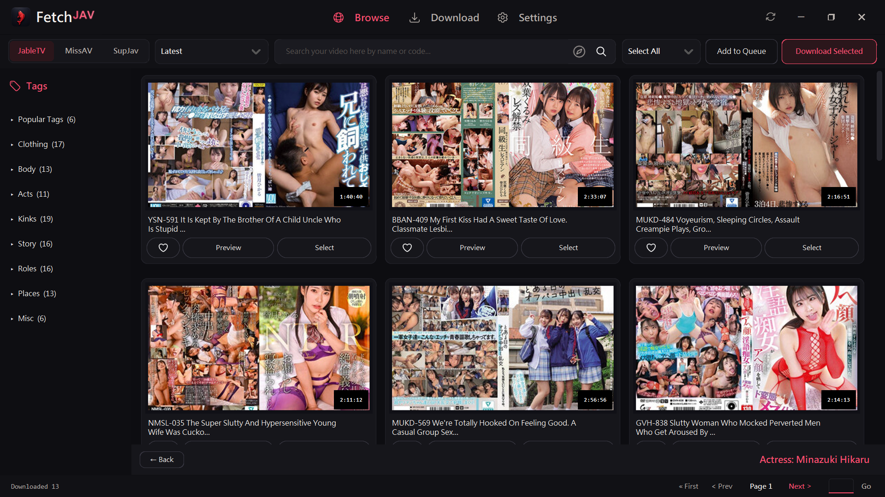
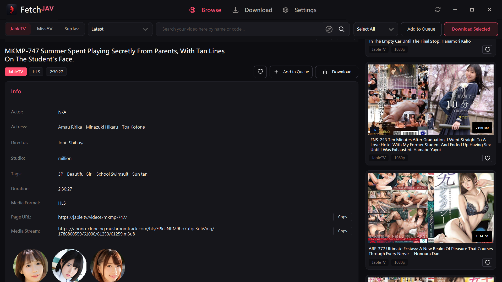

<p align="center">
  <strong>English</strong> · <a href="./README.md#-繁體中文-traditional-chinese">繁體中文</a>
</p>

<h1 align="center">FetchJAV</h1>

<p align="center">
  <strong>The Ultimate All-in-One Desktop Downloader, Video Streamer & AI Subtitle Generator</strong><br />
  Supports <strong>JableTV</strong>, <strong>MissAV</strong>, and <strong>SupJav</strong> with automated speech recognition, instant preview proxy, and cross-site metadata matching.
</p>

<p align="center">
  <a href="https://github.com/DeepanshuK2002/FetchJAV/releases/latest"></a>
  <a href="https://github.com/DeepanshuK2002/FetchJAV/releases"></a>
  <a href="https://github.com/DeepanshuK2002/FetchJAV"></a>
  <a href="./LICENSE"></a>
  <a href="https://github.com/DeepanshuK2002/FetchJAV/pkgs/container/jabletv"></a>
</p>

<p align="center">
  <strong><a href="https://github.com/DeepanshuK2002/FetchJAV/releases/latest/download/FetchJAV.exe">⬇️ Download FetchJAV.exe (Windows Direct)</a></strong>
  ·
  <a href="https://github.com/DeepanshuK2002/FetchJAV/releases/latest">📦 View Latest Release</a>
</p>

---

## ⚡ What Makes FetchJAV Superior?
### Exclusive Features (Not in the Original JableTV Downloader)

| Feature | FetchJAV | Original JableTV |
|---|---|---|
| **Direct Standalone .exe** | ✅ **`FetchJAV.exe`** with bundled FFmpeg, SSL certs, zero setup | ❌ Requires manual Python environment |
| **Local AI Speech Recognition** | ✅ Built-in offline **ReazonSpeech** & **Whisper** ASR models | ❌ No speech-to-text |
| **Automated Multi-Lingual Subtitles** | ✅ Auto-generates `.ja.srt`, `.en.srt`, `.zh-TW.srt` without touching MP4 | ❌ No subtitle generation |
| **Cloud LLM Translation Option** | ✅ Supports OpenAI, Claude, DeepSeek, Ollama, Gemini API translation | ❌ None |
| **Instant Streaming Video Preview** | ✅ Built-in local HTTP proxy with on-the-fly TS segment header repair | ❌ Must download entire video first |
| **SupJav Multi-Server Support** | ✅ Instant TV server streaming + automatic mirror fallback | ❌ No SupJav or mirror failover |
| **Modern Dark Theme & Customization** | ✅ CustomTkinter UI with accent color selector & responsive cards | ❌ Basic legacy interface |
| **Persistent History & Queue** | ✅ Queue & completed history saved across restarts with 1-click re-download | ❌ Session lost on exit |
| **Cross-Site Metadata Matching** | ✅ Cross-searches MissAV & SupJav to fill actress, studio, director & tags | ❌ Single-site only |
| **System Tray Background Mode** | ✅ Minimize to tray via `pystray` with download completion alerts | ❌ No tray support |
| **Network & SSL Crash Prevention** | ✅ Shared SSLContext & `curl_cffi` engine fixing Windows OpenSSL crashes | ❌ Common native SSL crashes |

---

## 📸 Screenshots & Interface Showcase

<p align="center">
  <strong>Browse & Search Gallery (JableTV, MissAV, SupJav)</strong><br />
  
</p>

<p align="center">
  <strong>Real-Time Streaming Video Preview</strong><br />
  
</p>

<p align="center">
  <strong>Multi-Threaded Download Queue with Speed Meter</strong><br />
  
</p>

<p align="center">
  <strong>AI Subtitles & Translation Settings (Local & LLM)</strong><br />
  
</p>

<p align="center">
  <strong>Persistent Download History with Metadata & Tags</strong><br />
  
</p>

---

## 🚀 Windows: Quick Start in 30 Seconds

1. **Download**: Grab **[FetchJAV.exe](https://github.com/DeepanshuK2002/FetchJAV/releases/latest/download/FetchJAV.exe)**.
2. **Launch**: Place the file in any writable folder and double-click to run. (No Python or external dependencies required).
3. **Choose Language**: On first launch, select your language (English, 繁體中文, 简体中文, 日本語) and customize your dark/light theme and accent color.
4. **Browse & Download**:
   - Navigate to **Browse**, select a site (JableTV, MissAV, or SupJav), browse categories or search keywords.
   - Select multiple cards and click **Add to Queue** or **Download Selected**.
   - You can also paste URLs directly into the **Download** tab, or import batch URLs from `.txt` or `.csv` files.

---

## 🛠️ Run from Source (macOS / Linux / Developer)

Requires **Python 3.10+** and Tk:

```bash
# Clone the repository
git clone https://github.com/DeepanshuK2002/FetchJAV.git
cd FetchJAV

# Install dependencies
python -m pip install -r requirements.txt

# Run the complete GUI
python main.py

# Or run headlessly with CLI options
python main.py --nogui --url "https://jable.tv/videos/example/" --output "./download" --max-workers-per-video 4
```

---

## 🐳 Docker / NAS Headless Deployment

The public container image is available at `ghcr.io/deepanshuk2002/fetchjav:latest`:

```bash
# Download a single URL to /downloads folder
docker run --rm -v "/path/to/downloads:/downloads" \
  ghcr.io/deepanshuk2002/fetchjav:latest "https://jable.tv/videos/example/"

# Docker Compose: pass urls via urls.txt
docker compose run --rm jabletv
```

---

## 🤝 Contributing & Bug Reports

When opening a [GitHub Issue](https://github.com/DeepanshuK2002/FetchJAV/issues/new), please include:
- App version and operating system.
- Target website, reproducible URL, and error messages.
- If a crash occurred, attach `crash_log.txt` from beside the executable.

---

## 📜 License & Disclaimer

Code is open source under the [Apache License 2.0](./LICENSE). Use this tool only for lawful personal or research purposes.
See [GitHub Releases](https://github.com/DeepanshuK2002/FetchJAV/releases) for version notes.
