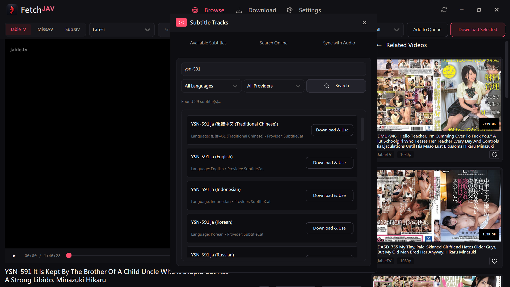
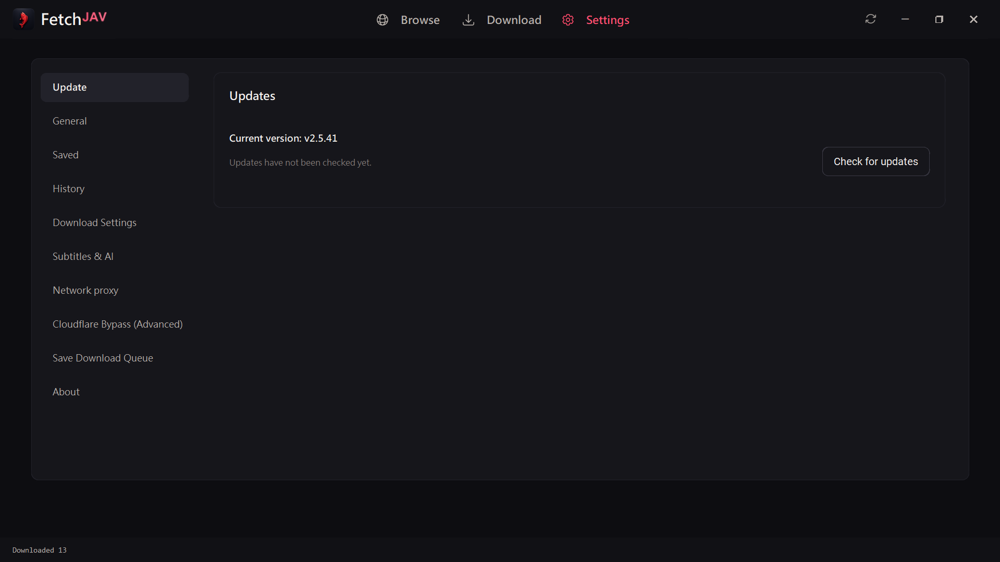
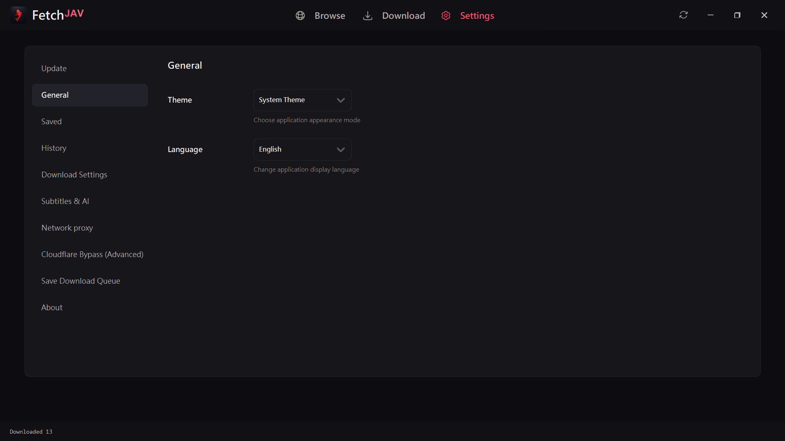
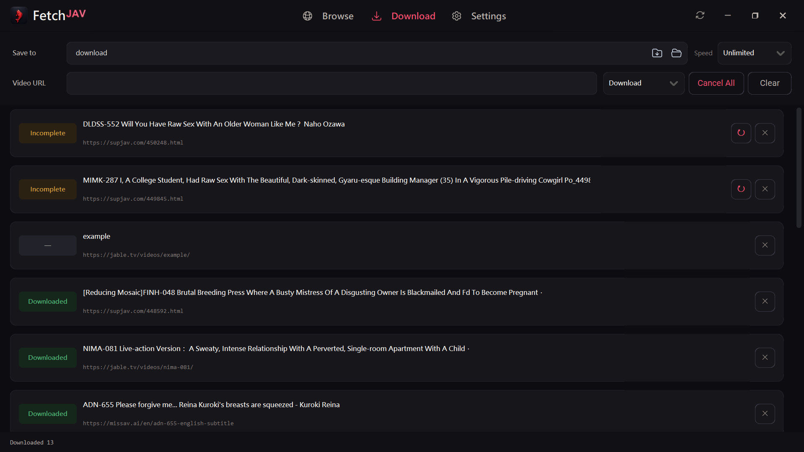

[README_readonly.md](https://github.com/user-attachments/files/31248086/README_readonly.md)
<h1 align="center">FetchJAV</h1>

<p align="center">
  <strong>The Ultimate Desktop Video Downloader, Real-Time Streamer & AI Subtitle Generator</strong><br />
  Stream, download, and automatically transcribe videos from <strong>JableTV</strong>, <strong>MissAV</strong>, <strong>SupJav</strong>, and 30+ other sites — with local &amp; cloud AI subtitle engines.
</p>

<p align="center">
  <strong>Download FetchJAV.exe (Windows Direct)</strong>
  &middot;
  View Latest Release
</p>

---

## Table of Contents

- About
- Key Features
- Visual Walkthrough
- Quick Start
- Installation
  - Windows Standalone
  - From Source
  - Docker / NAS Headless
- Usage
  - GUI Usage
  - CLI Usage
  - Docker CLI
  - Hot Reload (Developer Mode)
- Configuration
  - Preferences File
  - Key Settings
  - Proxy Configuration
  - Supported Site Mirrors
- AI Subtitle Pipeline
  - Local Offline ASR
  - Cloud LLM Translation
  - Online Subtitle Providers
- Supported Sites
- Technology Stack
- Project Structure
- Testing
- Troubleshooting
- Contributing
- License
- Disclaimer
- Acknowledgments


---

## About

FetchJAV is a feature-rich Python desktop application for downloading, streaming, and subtitle-generating from adult video websites. It is a customized fork of JableTV-MissAV-Downloader-GUI-2026 by ALOS, significantly extended with a modern CustomTkinter UI, an AI-powered subtitle pipeline, a built-in video preview player, cross-site metadata aggregation, Docker/NAS headless deployment, and an automated upstream sync system.

**What it does:**

- Browse, search, and discover videos across 30+ sites in a unified gallery interface
- Stream videos in real-time before downloading via a built-in HTTP proxy player
- Download videos at high speed with multi-threaded segment-level parallelism
- Automatically generate Japanese, English, and Traditional Chinese subtitles using local ASR and cloud LLM translation
- Maintain persistent download history, view history, and saved video libraries
- Deploy headlessly on NAS/Docker for unattended batch downloading

**Author:** Forked and extended by DeepanshuK2002 as "FetchJAV"
**Upstream:** Alos21750/JableTV-MissAV-Downloader-GUI-2026

---

## Key Features

| Feature | Description |
|---------|-------------|
| **Multi-Site Unified Browser** | Browse JableTV, MissAV, SupJav, and more in a single tab with search, filtering, cover cards, actress links, and multi-select bulk download |
| **Real-Time Streaming Preview** | Built-in local HTTP streaming proxy handles Range requests, repairs TS/MP4 headers, strips anti-scraping fake headers — watch before you download |
| **CC Subtitle Player** | In-app subtitle overlay with online search, local `.srt`/`.vtt` loading, audio sync, track switching |
| **High-Performance Download Manager** | Up to 32 simultaneous videos, 1–16 segment workers per video, bandwidth metering, speed limiting, resume/retry |
| **AI Subtitle Pipeline** | Post-download automatic Japanese audio extraction; local ReazonSpeech/Whisper ASR; optional cloud LLM translation (OpenAI, Claude, DeepSeek, Ollama, Gemini) |
| **Persistent History** | Download history, view history, and saved videos persist across restarts |
| **Modern Dark UI** | CustomTkinter Material Design dark theme with accent color customization (Pink, Blue, Violet, Amber, Green), high-DPI support |
| **Advanced Proxy** | HTTP/HTTPS/SOCKS4/SOCKS5 proxy, Windows system proxy auto-detection, Cloudflare clearance cookie import |
| **System Tray** | Minimize to Windows system tray for background downloading with pystray notifications |
| **Auto-Update** | Checks GitHub releases for updates, downloads and applies via batch file |
| **Hot Reload** | Developer mode watches source files and auto-restarts the app on changes |
| **Cross-Site Metadata** | Aggregates actress, studio, director, and tag metadata from multiple sites |
| **Crash Logging** | Global crash logger for Python exceptions and native crashes with user-facing dialog |
| **Docker/NAS Deployment** | Headless CLI mode via `docker_cli.py` with Docker Compose support |
| **Multi-language** | Full i18n in English, Traditional Chinese, Simplified Chinese, and Japanese |
| **Clip Import** | Clipboard monitoring auto-detects valid URLs; `.txt`/`.csv` batch import |
| **Online Subtitle Providers** | Integration with OpenSubtitles, Podnapisi, SubDL, SubtitleCat, YTS Subtitles |

---

## Visual Walkthrough

### 1. Multi-Site Browse & Discovery Gallery

Browse, search, and filter videos across **JableTV**, **MissAV**, and **SupJav** in a single unified interface. Features responsive high-resolution cover cards, actress links, studio details, and multi-selection for bulk downloads.

<p align="center">
  
</p>

### 2. Real-Time Streaming Video Preview & CC Subtitle Player

Watch full streams directly inside FetchJAV before downloading. Built-in local HTTP streaming proxy automatically handles HTTP range requests, repairs segmented TS/MP4 chunks, and strips anti-scraping fake headers on the fly. Includes an integrated **Closed Caption (CC)** menu with online subtitle search across multiple providers, local `.srt`/`.vtt` loading, audio speech sync, and highlighted track switching.

<p align="center">
  
</p>

<p align="center">
  
</p>

### 3. High-Performance Multi-Threaded Download Manager

Download multiple videos simultaneously with individual segment worker threads (1–16 workers per video), real-time bandwidth meters, segment progress trackers, and individual retry for interrupted chunks.

<p align="center">
  
</p>

### 4. Built-in Local & Cloud AI Subtitle Pipeline

Automatically extract Japanese audio and generate `.ja.srt`, `.en.srt`, and `.zh-TW.srt` subtitle files right after downloading — without altering the original MP4 video:

- **Local Offline ASR**: Integrated **ReazonSpeech** and **Whisper** speech recognition running directly on your CPU/GPU with zero cloud dependencies.
- **AI Translation Options**: Optional integration with OpenAI, Claude, DeepSeek, Ollama, and Gemini API endpoints for precision subtitle translation.

<p align="center">
  
</p>

<p align="center">
  
</p>

### 5. Persistent Download History & Metadata Inspector

Never lose track of your library. All completed downloads and metadata (actresses, tags, release dates, video codes) are preserved across app restarts with 1-click folder opening and instant re-downloading.

<p align="center">
  
</p>

### 6. Modern Dark UI & Accent Color Customization

Designed with a sleek CustomTkinter interface supporting high-DPI scaling, dark/light themes, and selectable accent color themes (Pink, Blue, Violet, Amber, Green).

<p align="center">
  
</p>

### 7. Advanced Network & Proxy Architecture

Full support for custom HTTP, HTTPS, SOCKS4, and SOCKS5 proxies, plus automatic synchronization with Windows manual proxy server settings. Built with `curl_cffi` and a shared SSLContext to eliminate native OpenSSL crash issues.

<p align="center">
  
</p>

### 8. System Tray Minimization & Background Operation

Minimize FetchJAV to the Windows system tray via `pystray` to allow uninterrupted background batch downloading, complete with status notifications.

<p align="center">
  
</p>

### 9. Comprehensive General Settings

Configure destination folders, default resolution preferences (Highest, 1080p, 720p, 480p, Lowest), multi-language UI selection (English, Traditional Chinese, Simplified Chinese, Japanese), and auto-update checks.

<p align="center">
  
</p>

---

## Quick Start

### Windows: Ready in 30 Seconds

1. **Download**: Get the latest FetchJAV.exe.
2. **Run**: Place it in any writable folder and double-click to launch (no Python or FFmpeg installation required).
3. **Choose Language**: On first launch, pick your language and preferred theme.
4. **Browse & Download**:
   - In **Browse**, choose JableTV, MissAV, or SupJav, search keywords or browse categories.
   - Click preview to watch immediately, or select cards to add to the download queue.
   - Paste URLs directly or import `.txt` / `.csv` batches in the **Download** tab.

> **Windows Security Note:** SmartScreen reputation warnings and Defender Antivirus isolation are different events. Please read Windows Security Guide before filing issues. Verify `SHA256SUMS.txt` against GitHub provenance.


**GUI Tabs:**

| Tab | Description |
|-----|-------------|
| **Browse** | Unified multi-site browser with search, categories, and cover gallery |
| **Download** | Paste URLs, import batch files, manage download queue |
| **History** | View completed downloads with metadata and re-download options |
| **Settings** | Configure themes, proxy, subtitle, resolution, and more |


### Key Settings

| Setting | Values | Default |
|---------|--------|---------|
| **Theme** | `dark`, `light`, `system` | `dark` |
| **Language** | `en`, `zh` (Traditional), `zh-Hans` (Simplified), `ja` | prompted on first launch |
| **Resolution** | `highest`, `lowest`, `1080`, `720`, `480`, `360` | `highest` |
| **Subtitle Mode** | `none`, `ja`, `en`, `zh`, `all` | `none` |
| **Recognition Quality** | `auto`, `quality`, `balanced`, `fast` | `auto` |
| **Download Concurrency** | 1–32 simultaneous videos | `2` |
| **Workers Per Video** | 1–16 segment workers | `min(cpu_count * 2, 16)` |
| **Proxy Mode** | `manual`, `system`, `direct` | `direct` |

### Proxy Configuration

FetchJAV supports full proxy configuration:

| Protocol | Support |
|----------|---------|
| HTTP | Yes |
| HTTPS | Yes |
| SOCKS4 / SOCKS4a | Yes |
| SOCKS5 / SOCKS5h | Yes |
| Windows System Proxy Auto-Detection | Yes |
| Cloudflare Clearance Cookie Import | Yes |

### Supported Site Mirrors

```python
MIRRORS = {
    'missav':   ['missav.ai', 'missav.ws', 'missav123.com', 'missav.live'],
    'jable':    ['jable.tv', 'fs1.app'],
    'supjav':   ['supjav.com', 'supjav.net', 'supjav.org'],
    'hanime1':  ['hanime1.me'],
    'hanimetv': ['hanime.tv'],
    'tnaflix':  ['www.tnaflix.com'],
}
```

---

## AI Subtitle Pipeline

FetchJAV includes a comprehensive AI-powered subtitle generation pipeline that runs automatically after video downloads.

### Local Offline ASR

Speech recognition runs entirely on your machine with no cloud dependencies:

| Engine | Language | Model | Notes |
|--------|----------|-------|-------|
| **Whisper** (whisper.cpp v1.9.1) | Japanese | Various sizes | Downloaded on first use from GitHub releases |
| **ReazonSpeech** | Japanese | Custom ASR model | Optional model pack download (`Jable_reazonspeech_asr_v1.zip`) |

**Recognition Quality Modes:**
- `quality` — Maximum accuracy, slower processing
- `balanced` — Good balance of speed and accuracy
- `fast` — Prioritize speed over accuracy
- `auto` — Automatic selection based on system capabilities

### Cloud LLM Translation

Optional cloud AI translation for generating English and Chinese subtitles from Japanese ASR output:

| Provider | Endpoint | Notes |
|----------|----------|-------|
| **OpenAI** | GPT-4 / GPT-3.5 | Requires API key |
| **Anthropic Claude** | Claude 3 / 3.5 | Requires API key |
| **DeepSeek** | DeepSeek Chat | Requires API key |
| **Ollama** | Local models | No API key needed, runs locally |
| **Google Gemini** | Gemini Pro | Requires API key |


### Online Subtitle Providers

FetchJAV can also search and download existing subtitle files from:

| Provider | URL |
|----------|-----|
| OpenSubtitles | opensubtitles.org |
| Podnapisi | podnapisi.net |
| SubDL | subdl.com |
| SubtitleCat | subtitlecat.com |
| YTS Subtitles | yts-subs.com |

---

## Supported Sites

FetchJAV supports 30+ websites through its modular site adapter system:

| Site | Adapter | Notes |
|------|---------|-------|
| **JableTV** | `SiteJableTV.py` | Primary site, `jable.tv`, `fs1.app` |
| **MissAV** | `SiteMissAV.py` | Primary site, multiple mirrors |
| **SupJav** | `SiteSupJav.py` | Multiple mirrors |
| **Hanime1** | `SiteHanime1.py` | `hanime1.me` |
| **HanimeTV** | `SiteHanimeTV.py` | `hanime.tv` |
| **TnaFlix** | `SiteTnaFlix.py` | `tnaflix.com` |
| **91Porn** | `Site91Porn.py` | 91Porn and variants |
| **JavDB** | `SiteJavDB.py` | JavDB and variants |
| Jable.org | Inherited | Mirror |
| ThisAV | Additional | — |
| PigAV | Additional | — |
| Porn5F | Additional | — |
| 85Tube | Additional | — |
| PornBest | Additional | — |
| HAnime XYZ | Additional | — |
| PornTW | Additional | — |
| PornJP | Additional | — |
| PornHK | Additional | — |
| PornHoHo | Additional | — |
| PornNVR | Additional | — |
| Video01 | Additional | — |
| PornLuLu | Additional | — |
| MIEN321 | Additional | — |
| AApp11 | Additional | — |
| Seselah | Additional | — |
| XJISHI | Additional | — |

---

## Technology Stack

### Language & Runtime

- **Python 3.10+**
- Small JavaScript/Node.js components for HanimeTV extractor (`hanimetv_extractor.mjs`)

### GUI Frameworks

- **CustomTkinter** — Modern dark UI (`gui_modern.py`, ~11,000 lines)
- **Tkinter/ttk** — Classic fallback GUI (`gui.py`)
- **pystray** — Windows system tray integration

### Networking & Web Scraping

| Library | Purpose |
|---------|---------|
| `requests` | HTTP client |
| `curl_cffi` | TLS-fingerprint-resistant HTTP (anti-bot bypass) |
| `cloudscraper` | Cloudflare bypass |
| `beautifulsoup4` | HTML parsing |
| `m3u8` | M3U8 HLS playlist parsing |
| `PySocks` | SOCKS proxy support |
| `certifi` | CA certificate bundle |

### Video & Media

| Library | Purpose |
|---------|---------|
| `imageio-ffmpeg` | FFmpeg binary bundling (TS→MP4 remux) |
| `python-vlc` | VLC-based video preview playback |
| `Pillow` | Image processing |
| `pycryptodome` | HLS AES-128 encryption handling |

### AI / Subtitle Engine

| Library | Purpose |
|---------|---------|
| `whisper.cpp` (C++ binary) | Japanese speech recognition |
| ReazonSpeech | Alternative Japanese ASR |
| `ctranslate2` 4.8.1 | Local neural machine translation |
| `sentencepiece` | Tokenizer for translation models |
| `opencc-python-reimplemented` | Traditional/Simplified Chinese conversion |
| `numpy` 2.5.1 | Numerical operations for CTranslate2 |
| `PyYAML` 6.0.3 | Model configuration parsing |

### Build & Development

| Tool | Purpose |
|------|---------|
| `PyInstaller` | Building standalone Windows executables |
| `pytest` | Test framework |
| `hot_reload.py` | Dev hot-reload framework |

---

## Project Structure

```
FetchJAV/
├── main.py                          # Application entry point
├── gui.py                           # Classic Tkinter GUI (fallback)
├── gui_modern.py                    # Modern CustomTkinter GUI (~11,000 lines)
├── ui_theme.py                      # Theme/design system
├── config.py                        # Configuration, preferences, proxy, history
├── args.py                          # CLI argument parser
├── browser.py                       # Browse panel with site adapters
├── subtitle_engine.py               # Local ASR + translation engine (~5,300 lines)
├── subtitle_domain.py               # Subtitle domain logic
├── llm_translation.py               # LLM-based translation (OpenAI, Claude, etc.)
├── translation_settings.py          # Translation settings data
├── translation_settings_ui.py       # Translation settings UI
├── video_preview.py                 # In-app video preview player
├── video_identity.py                # Video identity/metadata detection
├── metadata_fetcher.py              # Cross-site metadata aggregation
├── hot_reload.py                    # Dev hot-reload framework
├── updater.py                       # Auto-updater
├── crashlog.py                      # Global crash logging
├── analytics.py                     # Analytics/telemetry
├── locales.py                       # i18n strings (en, zh, zh-Hans, ja)
├── ssl_util.py                      # Shared SSL adapter
├── site_i18n.py                     # Site-specific i18n
├── docker_cli.py                    # Headless Docker/NAS CLI
├── Dockerfile                       # Docker image definition
├── docker-compose.yml               # Docker Compose for NAS
│
├── M3U8Sites/                       # Site scraper adapters
│   ├── __init__.py                  # Site registry, factory, URL validation
│   ├── M3U8Crawler.py               # Core M3U8 download engine
│   ├── SiteJableTV.py               # JableTV scraper
│   ├── SiteMissAV.py                # MissAV scraper
│   ├── SiteSupJav.py                # SupJav scraper
│   ├── SiteHanime1.py               # Hanime1 scraper
│   ├── SiteHanimeTV.py              # HanimeTV scraper
│   ├── SiteTnaFlix.py               # TnaFlix scraper
│   ├── Site91Porn.py                # 91Porn scraper
│   └── SiteJavDB.py                 # JavDB scraper
│
├── subtitle/                        # FetchJAV subtitle package
│   ├── __init__.py                  # Exports SubtitleManager, SubtitleTrack, etc.
│   ├── manager.py                   # Subtitle orchestration
│   ├── models.py                    # Data models
│   ├── parser.py                    # SRT/VTT parser
│   ├── cache.py                     # Subtitle caching
│   ├── sources/                     # Subtitle sources
│   │   ├── online.py                # Online subtitle search
│   │   ├── local.py                 # Local file loading
│   │   └── generated.py             # AI-generated subtitles
│   └── providers/                   # Online subtitle providers
│       ├── base.py                  # Base provider
│       ├── opensubtitles.py         # OpenSubtitles integration
│       ├── podnapisi.py             # Podnapisi integration
│       ├── subdl.py                 # SubDL integration
│       ├── subtitlecat.py           # SubtitleCat integration
│       └── ytssubs.py               # YTS Subtitles integration
│
├── tests/                           # 47 test files (670+ tests)
├── scripts/                         # Build & maintenance scripts
├── docs/                            # Documentation
├── img/                             # Icons, screenshots, favicons
├── dist/                            # Pre-built release executables
│   ├── FetchJAV.exe
│   ├── FetchJAV_Modern.exe
│  
│   
│
├── requirements.txt                 # Python dependencies (GUI)
├── requirements-docker.txt          # Python dependencies (Docker)
├── LICENSE                          # Apache License 2.0
├── README.md                        # This file
├── README.en.md                     # English-only README
├── WINDOWS_SECURITY.md              # Windows security/antivirus guidance
├── THIRD_PARTY_NOTICES.md           # Third-party license notices
└── .github/workflows/              # CI/CD
    ├── windows-build.yml            # Windows build pipeline
    ├── docker-publish.yml           # Docker image publishing
    └── star-history.yml             # Star history chart
```

---

## Testing

FetchJAV includes a comprehensive test suite with **670+ tests** across 47 test modules.

### Manual Regression

A manual regression checklist is maintained at `docs/REGRESSION_CHECKLIST.md` covering:
- GUI functionality (browse, download, settings, themes)
- Subtitle pipeline (ASR, translation, provider search)
- Data safety (persistence, history, queue)
- Packaging (PyInstaller build, Docker build)

---

## Building from Source

FetchJAV uses PyInstaller to create standalone Windows executables.

### Prerequisites

- Python 3.10+
- All dependencies from `requirements.txt`
- PyInstaller

### Build Commands

```bash
# Generate version info
python build_tmp/gen_version.py

# Build the executable (using PyInstaller spec files in build_tmp/)
pyinstaller build_tmp/FetchJAV.spec

# Output: dist/FetchJAV.exe
```

### Build Artifacts

| File | Description |
|------|-------------|
| `dist/FetchJAV.exe` | Main GUI executable |

### CI/CD

GitHub Actions workflows in `.github/workflows/`:
- `windows-build.yml` — Automated Windows build pipeline
- `docker-publish.yml` — Docker image publishing to GHCR

---

## Troubleshooting

### Common Issues

| Issue | Solution |
|-------|----------|
| **Windows SmartScreen warning** | Right-click → Properties → Unblock, or click "More info" → "Run anyway". See WINDOWS_SECURITY.md |
| **Defender Antivirus quarantine** | This is different from SmartScreen. Do NOT lower protection settings. Verify SHA256 checksums and report if needed |
| **FFmpeg not found** | On Windows: bundled via `imageio-ffmpeg`. On Linux: `apt install ffmpeg` |
| **VLC not found for preview** | Install VLC or disable video preview. VLC is optional |
| **Whisper model download fails** | Check internet connection. Models are downloaded from GitHub releases on first use |
| **SSL/TLS errors** | FetchJAV uses `curl_cffi` to avoid native OpenSSL issues. If problems persist, try `--nogui` mode or check proxy settings |
| **Cloudflare blocking** | Import Cloudflare clearance cookies via Settings → Network → Cloudflare Override |
| **Video not downloading** | Check if the site is accessible. Try updating FetchJAV. Some sites may require proxy |

### Diagnostic Commands

```bash
# Whisper diagnostic
FetchJAV_WHISPER_DIAGNOSTIC_INPUT=file.wav \
FetchJAV_WHISPER_DIAGNOSTIC_OUTPUT=result.json \
python main.py

# Local translation diagnostic
FetchJAV_LOCAL_TRANSLATION_DIAGNOSTIC_OUTPUT=result.json python main.py

# LLM translation diagnostic
FetchJAV_LLM_TRANSLATION_DIAGNOSTIC_OUTPUT=result.json python main.py
```

### Crash Logs

If FetchJAV crashes, a `crash_log.txt` file is generated beside the executable. Include this file when filing an issue.

---

## Contributing

Contributions are welcome! When opening a GitHub Issue, please include:

- **App version** and **operating system**
- **Target website**, **reproducible URL**, and **error messages**
- If a crash occurred, attach `crash_log.txt`
- Screenshots if the issue is UI-related


### Upstream Sync

FetchJAV maintains an automated sync with the upstream repository. See `docs/UPSTREAM_SYNC.md` for the detailed 3-way merge workflow and `docs/sync/ownership.json` for file ownership mapping.

---

## License

FetchJAV is licensed under the **Apache License, Version 2.0** — see LICENSE for details.

### Third-Party Licenses

FetchJAV bundles or integrates with the following third-party components:


## Disclaimer

This tool is provided for **personal research and legal backup purposes only**. Users are responsible for complying with local laws and the terms of service of any website accessed through this tool. The developers assume no liability for misuse.

---

## Acknowledgments

- **ALOS (Alos21750)** — Original author of JableTV-MissAV-Downloader-GUI-2026
- **DeepanshuK2002** — FetchJAV fork maintainer and primary contributor
- All contributors and testers who help improve FetchJAV

---

## Changelog & Releases

See GitHub Releases for the latest version history and release notes.

